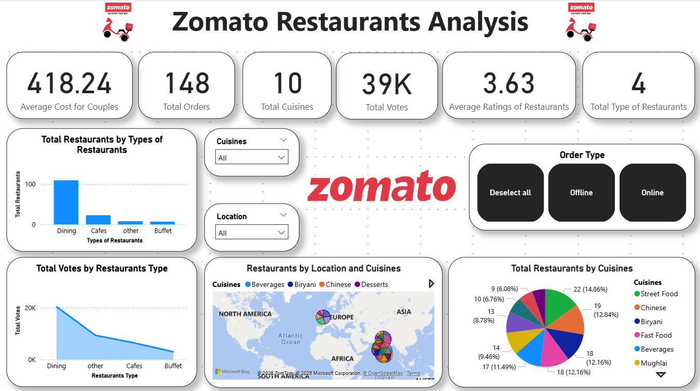

# Zomato Restaurant Analysis

This project analyzes Zomato restaurant data to understand customer preferences, ratings, spending behavior, and online ordering trends. The analysis helps identify which restaurant types, cuisines, locations, and order modes perform best.

## 📊 Key Insights
- Dining restaurants are the most common and most preferred type
- Street Food and North Indian cuisines receive the highest votes
- Most restaurant ratings lie between 3.5 and 4.0
- Online orders receive higher ratings than offline orders
- Indiranagar, Bandra, and Andheri have the highest number of restaurants
- Couples spend around ₹500 on average for online orders

## 🛠️ Project Files
- `zomato.csv` – Dataset
- `Zomato.ipynb` – Data cleaning and analysis in Python
- `Zomato_Dashboard.pbix` – Power BI dashboard
- `Zomato Restaurant Analysis.pptx` – Presentation

## 🧰 Tools and Technologies
- Python
- Pandas, Matplotlib, Seaborn
- Power BI
- Jupyter Notebook

## 📸 Dashboard Preview

## 🚀 How to Use
1. Open `Zomato.ipynb` to view the analysis
2. Open `Zomato_Dashboard.pbix` to explore the interactive dashboard
3. Review insights in the presentation file

## 📌 Conclusion
Dining restaurants dominate both presence and popularity. Online ordering shows higher satisfaction. Key cuisines like Street Food and North Indian lead engagement, and metro hubs remain top food locations.